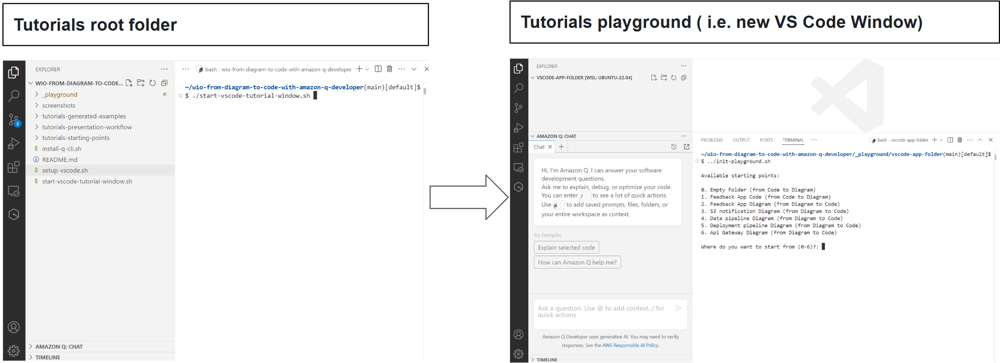

# **From Diagram to Code with Amazon Q Developer**

This repo is a list of tutorials related to this blog post:

https://dev.to/welcloud-io/from-diagram-to-code-with-amazon-q-developer-2da4

You can also find some live demos in these videos:

https://www.youtube.com/watch?v=D6cYFDoX1Es&list=PL7uUliWSzuvF0GS9jpaFGQxLKGC0CC2vq
https://www.youtube.com/watch?v=QuAlzUVqi7I&t=4293s

This demonstrates how you can generate diagrams from an application code, but also how to generate code from diagrams using Amazon Q Developer in the Visual Studio Code IDE.


---

# Tutorial Index

1. [Generate Mermaid Diagram from Code](tutorials/TUTORIALS.md#1-generate-mermaid-diagram-from-code)

    - 1.1 [Generate Mermaid - Architecture Diagram - from Code - Feedback App](tutorials/TUTORIALS.md#11-generate-mermaid---architecture-diagram---from-code---feedback-app)
    - 1.2 [Generate Mermaid - Sequence Diagram - from Code - Feedback App](tutorials/TUTORIALS.md#12-generate-mermaid---sequence-diagram---from-code---feedback-app)
    - 1.3 [Generate Mermaid - Class Diagram - from Code - Feedback App](tutorials/TUTORIALS.md#13-generate-mermaid---class-diagram---from-code---feedback-app)

2. [Generate Drawio Diagram from Code](tutorials/TUTORIALS.md#2-generate-drawio-diagram-from-code)

    - 2.1 [Generate Drawio - Architecture Diagram - from Code - Feedback App](tutorials/TUTORIALS.md#21-generate-drawio---architecture-diagram---from-code---feedback-app)

3. [Generate Code from Mermaid Diagram](tutorials/TUTORIALS.md#3-generate-code-from-mermaid-diagram)

    - 3.1 [Generate Code from Mermaid Diagram - Feedback App](tutorials/TUTORIALS.md#31-generate-code-from-mermaid-diagram---feedback-app)

4. [Generate Code from Drawio Diagram](tutorials/TUTORIALS.md#4-generate-code-from-drawio-diagram)

    - 4.1 [Generate Code from Drawio Diagram - Feedback App](tutorials/TUTORIALS.md#41-generate-code-from-drawio-diagram---feedback-app)
    - 4.2 [Generate Code from Drawio Diagram - S3 Notification](tutorials/TUTORIALS.md#42-generate-code-from-drawio-diagram---s3-notification)
    - 4.3 [Generate Code from Drawio Diagram - Step Functions](tutorials/TUTORIALS.md#43-generate-code-from-drawio-diagram---step-functions)
    - 4.4 [Generate Code from Drawio Diagram - Deployment Pipeline](tutorials/TUTORIALS.md#44-generate-code-from-drawio-diagram---deployment-pipeline)
    - 4.5 [Generate Code from Drawio Diagram - API Gateway](tutorials/TUTORIALS.md#45-generate-code-from-drawio-diagram---api-gateway)

5. [Generate Code from Hand-Drawn Diagram](tutorials/TUTORIALS.md#5-generate-code-from-hand-drawn-diagram)

    - 5.1 [Generate Code from HandDrawn Diagram - Lambda App](tutorials/TUTORIALS.md#51-generate-code-from-handdrawn-diagram---lambda-app)
    - 5.2 [Generate Code from HandDrawn Diagram - ECS App](tutorials/TUTORIALS.md#52-generate-code-from-handdrawn-diagram---ecs-app)
    - 5.3 [Generate Code from HandDrawn Diagram - GUI](tutorials/TUTORIALS.md#53-generate-code-from-handdrawn-diagram---gui)

6. [Transform Drawio Diagram](tutorials/TUTORIALS.md#6-transform-drawio-diagram)

    - 6.1 [Split Drawio Diagram into CDK Constructs](tutorials/TUTORIALS.md#61-split-drawio-diagram-into-cdk-constructs)
    - 6.2 [Generate C4 Model from AWS Layered Architecture](tutorials/TUTORIALS.md#62-generate-c4-model-from-aws-layered-architecture)

7. [Understand MCP](tutorials/TUTORIALS.md#7-understand-mcp)

    - 7.1 [Create Simplest MCP](tutorials/TUTORIALS.md#71-create-simplest-mcp)
    - 7.2 [Generate Python Diagrams - Arhitecture Diagram - from Code - Feedback App](tutorials/TUTORIALS.md#72-generate-python-diagrams---arhitecture-diagram---from-code---feedback-app)

8. [Understand AI Agents with Strands](tutorials/TUTORIALS.md#8-understand-ai-agents-with-strands)

    - 8.1 [Generate Strands AI agent from Diagram](tutorials/TUTORIALS.md#81-generate-strands-ai-agent-from-diagram)


# Prerequisites

I assume that you are using a **Linux Ubuntu 22-04** distribution, **but instructions below can be adapted** to your environment.

## 1) Install & start VS Code (If not done yet in your environment)

The official procedures to install & start VS Code is there:

https://code.visualstudio.com/docs/setup/linux#_debian-and-ubuntu-based-distributions

N.B.: These simple commands below work for me to intsall & start VS Code on Linux Ubuntu 22-04:

```
$> sudo snap install --classic code
$> code
```

## 2) Clone the repo & go to the tutorial folder

Open a terminal in VS Code and execute the following commands

```
$> git clone https://github.com/welcloud-io/wio-from-diagram-to-code-with-amazon-q-developer.git
$> cd wio-from-diagram-to-code-with-amazon-q-developer/
```

## 3) Configure VS Code (Manually or Automatically)

### 3.1) Configure VS Code Manually (Option 1)

N.B.
**You can attempt to configure VS Code automatically**
if it's a fresh installation (**see Option 2**)

### Install Amazon Q Developer extension & Enable @workspace

Q Developer plugin installation:
https://docs.aws.amazon.com/amazonq/latest/qdeveloper-ug/q-in-IDE-setup.html#setup-vscode

Q Developer setting options to tick: https://docs.aws.amazon.com/amazonq/latest/qdeveloper-ug/workspace-context.html

Then connect to Amazon Q with your builder ID

### Install Mermaid extension

https://marketplace.visualstudio.com/items?itemName=bierner.markdown-mermaid

### Install Draw.io Integration extension

https://marketplace.visualstudio.com/items?itemName=hediet.vscode-drawio

Then:
- Go to 'File > Preferences > Settings' 
- Search for 'editorasso' setting 
- Add the following association item: *.drawio.xml => hediet.vscode-drawio-text)

### 3.2) Configure VS Code Automatically (Option 2)

**Be aware that this may not work** if your environment has some settings already

```bash
$> ./setup/vs-code.sh
```

Once done, connect to Amazon Q Developer using your Builder ID (folow the procedure in VS Code)

## 4) Install CDK (only if you want to deploy the generated code)

```
curl -o- https://raw.githubusercontent.com/nvm-sh/nvm/master/install.sh | bash
. ~/.bashrc 
nvm install --lts
npm install -g aws-cdk
```

## 5) Install Q CLI & MCP utils

Amazon Q Developer CLI (Command Line Interface) and MCP utils are used for some tutorials, but not for all.

#### Install MCP Utils
To test MCP servers tutorials you should install uv & fastmcp.
You can use python pip or this script.

```
$> ./setup/mcp-utils.sh
```

#### Install Q CLI

To install Q CLI, you either follow this link:

https://docs.aws.amazon.com/amazonq/latest/qdeveloper-ug/command-line-installing.html

OR you can attempt using this script in you terminal (n.b. it's only been tested on Linux Ubuntu 22-04):

```bash
$> ./setup/q-cli.sh
```

# Start tutorials

## 1. Start Tutorial Window

The command below will open a new VS Code window. 
That means you will have a blank playground where you will import a tutorial starting point.

```bash
# From wio-from-diagram-to-code-with-amazon-q-developer/
$> ./start-vscode-tutorial-window.sh
```



## 2. Follow tutorial instructions in the tutorial page

[ => TUTORIAL PAGE](./tutorials/TUTORIALS.md)