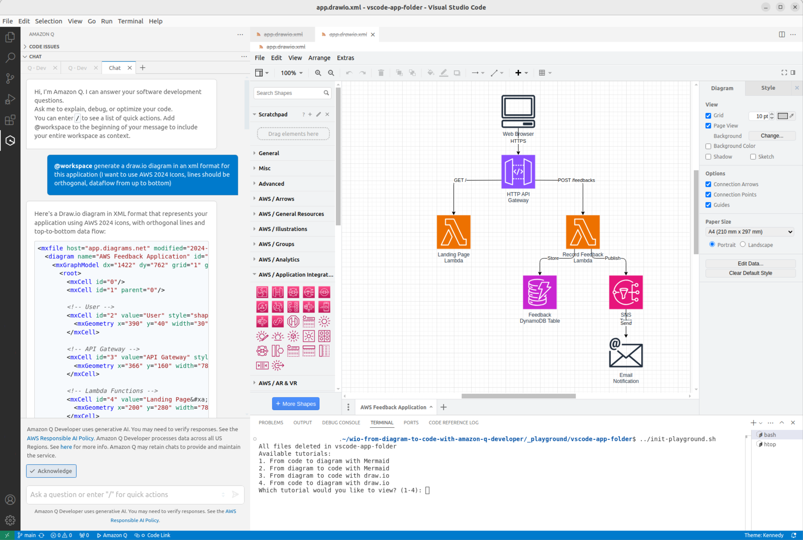

# **From Diagram to Code with Amazon Q Developer**

This repo is a list of tutorials based on this blog post:
https://github.com/welcloud-io/wio-from-diagram-to-code-with-amazon-q-developer

It demonstrates how you can generate diagrams from an application code, but also how to generate code from diagrams using Amazon Q Developer in the Visual Studio Code IDE.



---

# Prerequisites

I assume that you are running on **Linux Ubuntu 22-04**, but instructions below can be adapted to your environment.

## 1) Install & start VS Code (If not done yet in your environment)

The official procedures to install & start VS Code is there:

https://code.visualstudio.com/docs/setup/linux#_debian-and-ubuntu-based-distributions

N.B.: These simple commands below works for me to intsall & start VS Code on Linux Ubuntu 22-04:

```
$> sudo snap install --classic code
$> code
```

## 2) Clone the repo & go to the tutorial folder

Open a terminal in VS Code and execute the following commands

```
$> git clone https://github.com/welcloud-io/wio-from-diagram-to-code-with-amazon-q-developer.git
$> cd wio-from-diagram-to-code-with-amazon-q-developer/
```

## 3) Configure VS Code

### 3.1) Configure VS Code Manually (Option 1)

N.B.
__You can try to configure VS Code automatically__
if you start from a blank VS Code environement (__see Option 2__)

### Install Amazon Q Developer extension & Enable @workspace

Q Developer plugin installation:
https://docs.aws.amazon.com/amazonq/latest/qdeveloper-ug/q-in-IDE-setup.html#setup-vscode

Q Developer settings option to tick: https://docs.aws.amazon.com/amazonq/latest/qdeveloper-ug/workspace-context.html

Then connect to Amazon Q with your builder ID

### Install Mermaid extension

https://marketplace.visualstudio.com/items?itemName=bierner.markdown-mermaid

### Install Draw.io Integration extension

https://marketplace.visualstudio.com/items?itemName=hediet.vscode-drawio

Then:
- Go to 'File > Preferences > Settings' 
- Search for 'editorasso' setting 
- Add the following association item: *.drawio.xml => hediet.vscode-drawio-text)

### 3.2) Configure VS Code Automatically (Option 2)

**Be aware that this may not work** if you environment has some settings already

```bash
$> ./setup-vscode.sh
```

Once done, connect to Amazon Q Developer using your Builder ID (folow the procedure in VS Code)

# Start tutorials

## Follow tutorial instructions in the tutorial readme

[CLASSIC TUTORIALS INSTRUCTIONS](_playground/README.md)

[MORE TUTORIALS](_playground/README-More.md)