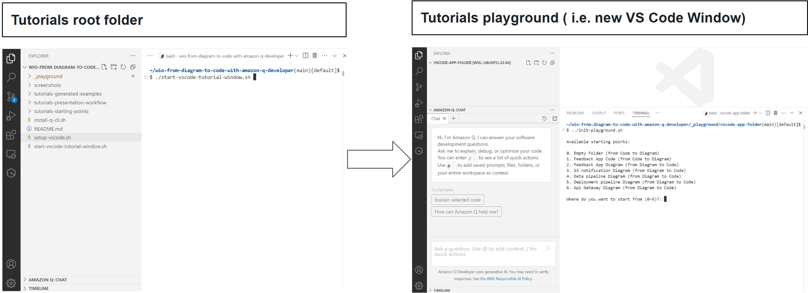
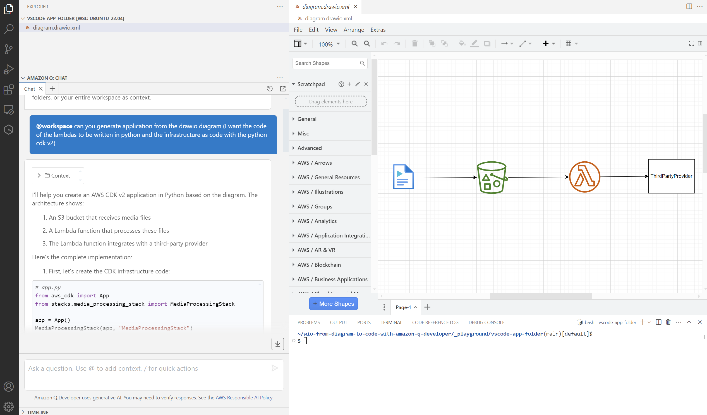
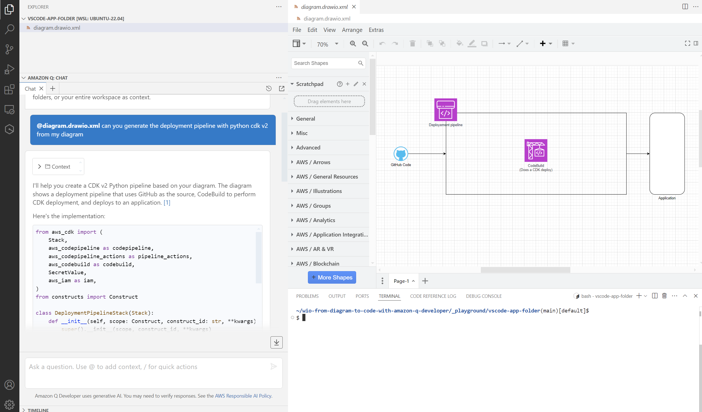
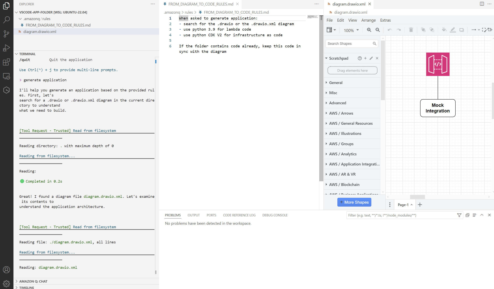

# 0 - Start tutorials playground ( i.e. new VS Code Window)

The command below will open a new VS Code window. 
That means you will have a blank playground where you will import a tutorial starting point.

```bash
# From wio-from-diagram-to-code-with-amazon-q-developer/
$> ./start-vscode-tutorial-window.sh
```




### **!!! IMPORTANT !!!** 
---
**1) Refreshing the @workspace index can help when you don't get the expected result, you can do it 2 ways:**

Remove amazonq cache content manually  
 ```$> rm ~/.aws/amazonq/cache/cache/*```
 
Then, reload VS Code window  
 ```Ctrl / Shift / P / Developer: Reload Window```

**OR**
 
Remove amazonq cache content automatically while initiating the tutorial   
 ``` ../init-playground.sh --hard ```

Then, reload VS Code window   
 ```Ctrl / Shift / P / Developer: Reload Window```

**2) When using ```@workspace```, 
you might need to**
-  type ```@workspace``` in Q manually 
- and then copy/paste the rest of the prompt

---

# 1 - S3 Notification

### Initialize tutorial

```bash
# From VS Code tutorial window terminal
$ ../init-playground.sh 

-------------------------------------------------------------------------------
# Refreshing the @workspace index can help when you don't get the expected result
# If needed, use: '../init-playground.sh --hard', then Ctrl+Shift+P => 'Developer: Reload Window'
-------------------------------------------------------------------------------

Available starting points:

0. Empty Folder (from Code to Diagram)
1. Feedback App Code (from Code to Diagram)
2. Feedback App Diagram (from Diagram to Code)
3. S3 notification Diagram (from Diagram to Code)
...

Where do you want to start from ?: 3
```

## Generate CDK templates + lambda

### Q Prompt >

---
**`@diagram.drawio.xml`**

```
can you generate application from the drawio diagram (I want the code of the lambdas to be written in python and the infrastructure as code with the python cdk v2)
```
---

### Result Example




# 2 - Data Pipeline

### Initialize tutorial

```bash
# From VS Code tutorial window terminal
$ ../init-playground.sh 

-------------------------------------------------------------------------------
# Refreshing the @workspace index can help when you don't get the expected result
# If needed, use: '../init-playground.sh --hard', then Ctrl+Shift+P => 'Developer: Reload Window'
-------------------------------------------------------------------------------

Available starting points:

0. Empty Folder (from Code to Diagram)
1. Feedback App Code (from Code to Diagram)
2. Feedback App Diagram (from Diagram to Code)
3. S3 notification Diagram (from Diagram to Code)
4. Data pipeline Diagram (from Diagram to Code)
...

Where do you want to start from ?: 4
```

## Generate StepFunctions Workflow only

### Q Prompt >

---
**`@diagram.drawio.xml`**

```
generate python CDK V2 code and the lambda functions of the step functions workflow only
```
---

### Result Example


# 3 - Deployment Pipeline

```bash
# From VS Code tutorial window terminal
$ ../init-playground.sh 

-------------------------------------------------------------------------------
# Refreshing the @workspace index can help when you don't get the expected result
# If needed, use: '../init-playground.sh --hard', then Ctrl+Shift+P => 'Developer: Reload Window'
-------------------------------------------------------------------------------

Available starting points:

0. Empty Folder (from Code to Diagram)
1. Feedback App Code (from Code to Diagram)
2. Feedback App Diagram (from Diagram to Code)
3. S3 notification Diagram (from Diagram to Code)
4. Data pipeline Diagram (from Diagram to Code)
5. Deployment pipeline Diagram (from Diagram to Code)
...

Where do you want to start from ?: 5
```

## Generate deployment pipeline

### Q Prompt >

---
**`@diagram.drawio.xml`**

```
can you generate the deployment pipeline with python cdk v2 from my diagram
```
---

### Result Example




# 4 - API Gateway

```bash
# From VS Code tutorial window terminal
$ ../init-playground.sh --with-q-rules

-------------------------------------------------------------------------------
# Refreshing the @workspace index can help when you don't get the expected result
# If needed, use: '../init-playground.sh --hard', then Ctrl+Shift+P => 'Developer: Reload Window'
-------------------------------------------------------------------------------

Available starting points:

0. Empty Folder (from Code to Diagram)
1. Feedback App Code (from Code to Diagram)
2. Feedback App Diagram (from Diagram to Code)
3. S3 notification Diagram (from Diagram to Code)
4. Data pipeline Diagram (from Diagram to Code)
5. Deployment pipeline Diagram (from Diagram to Code)
6. Api Gateway Diagram (from Diagram to Code)
...

Where do you want to start from ?: 6
```

## Generate API Gateway **with Q rules**

**!!! Make sure you have used --with-q-rules option during initialization**

```
$ ../init-playground.sh --with-q-rules
```

### Q Prompt >

---
**`$> q chat`**

```
generate application
```
---




# 5 - Build simplest MCP Server

### Initialize tutorial

```bash
# From VS Code tutorial window terminal
$ ../init-playground.sh --with-simplest-mcp-server

-------------------------------------------------------------------------------
# Refreshing the @workspace index can help when you don't get the expected result
# If needed, use: '../init-playground.sh --hard', then Ctrl+Shift+P => 'Developer: Reload Window'
-------------------------------------------------------------------------------

Available starting points:

0. Empty Folder (from Code to Diagram)
1. Feedback App Code (from Code to Diagram)
...

Where do you want to start from ?: 1
```

## Generate Diagram

**!!! Make sure you have used --with-simplest-mcp-server option during initialization**

**!!! Make sure you have installed q cli and MCP utils (see main README)**

### Q Prompt >

---
**`$> q chat`**

```
add 1 + 1
```
---

# 6 - Use existing MCP Server

### Initialize tutorial

```bash
# From VS Code tutorial window terminal
$ ../init-playground.sh --with-diagram-mcp-server

-------------------------------------------------------------------------------
# Refreshing the @workspace index can help when you don't get the expected result
# If needed, use: '../init-playground.sh --hard', then Ctrl+Shift+P => 'Developer: Reload Window'
-------------------------------------------------------------------------------

Available starting points:

0. Empty Folder (from Code to Diagram)
1. Feedback App Code (from Code to Diagram)
...

Where do you want to start from ?: 1
```

## Generate Diagram

**!!! Make sure you have used --with-diagram-mcp-server option during initialization**

**!!! Make sure you have installed q cli and MCP utils (see main README)**

### Q Prompt >

---
**`$> q chat`**

```
generate a diagram from the code in that folder
```
---

# 7 - Generate App from Hand Drawn Diagram

### N.B.: Install Q if not installed yet (c.f. [Installation Guide](../README.md))

```bash
# From VS Code tutorial window terminal
$ ../init-playground.sh

-------------------------------------------------------------------------------
# Refreshing the @workspace index can help when you don't get the expected result
# If needed, use: '../init-playground.sh --hard', then Ctrl+Shift+P => 'Developer: Reload Window'
-------------------------------------------------------------------------------

Available starting points:

0. Empty Folder (from Code to Diagram)
1. Feedback App Code (from Code to Diagram)
2. Feedback App Diagram (from Diagram to Code)
3. S3 notification Diagram (from Diagram to Code)
4. Data pipeline Diagram (from Diagram to Code)
5. Deployment pipeline Diagram (from Diagram to Code)
6. Api Gateway Diagram (from Diagram to Code)
7. Hand Drawn Diagram (from Diagram to Code)
...

Where do you want to start from ?: 7
```

### Q Prompt >

---
**`$> q chat`**


```
> /model
? Select a model for this chat session ›
❯ claude-4-sonnet
  claude-3.7-sonnet (active)
  claude-3.5-sonnet
# => Select claude-4-sonnet and type enter
```


```
create a mermaid diagram from the hand-drawn-architecture.jpg file in this folder
```

```
create a draw.io diagram from the hand-drawn-architecture.jpg (I want to use AWS 2024 Icons)
```

```
can you generate application from the hand-drawn-architecture file (I want the code of the lambdas to be written in python and the infrastructure as code with the python cdk v2)
```


---