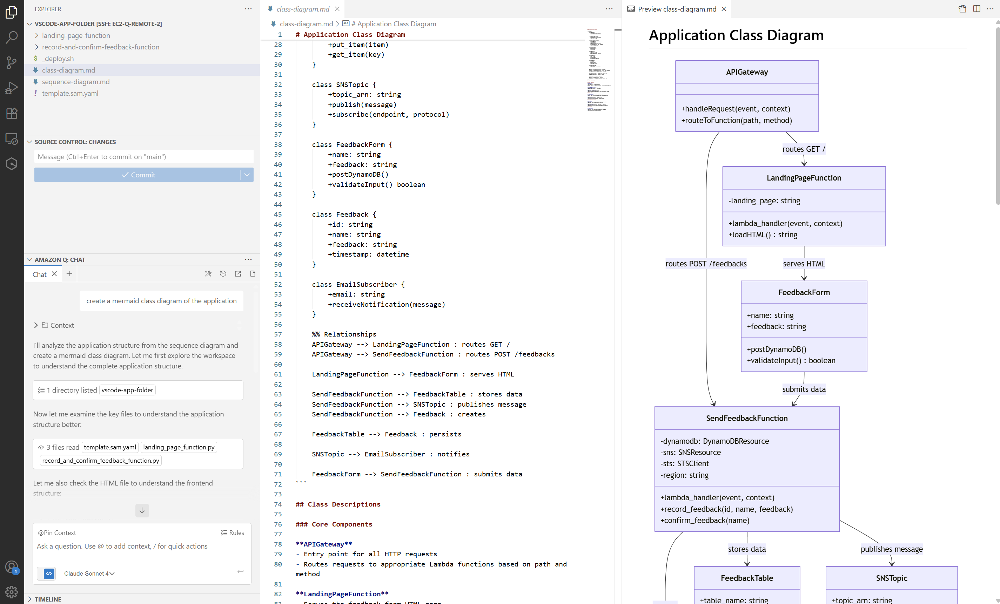
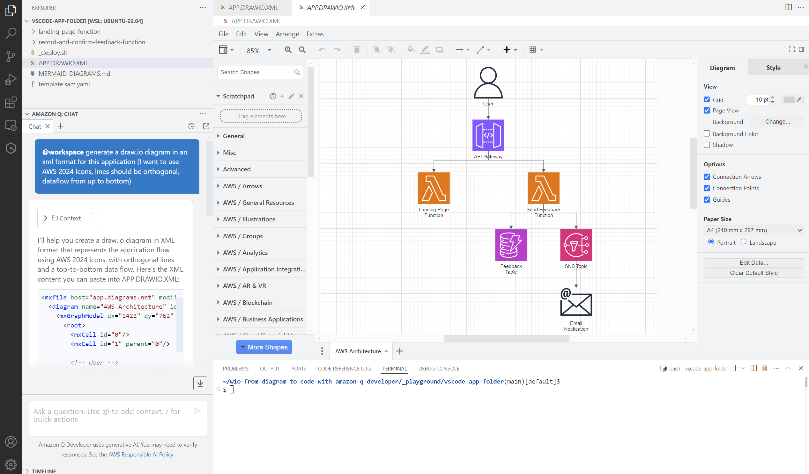

# 0 - Start tutorials playground ( i.e. a new VS Code Window)

The command below will open a new VS Code window. 
That means you will have a blank playground where you will import a tutorial starting point.

```bash
# From wio-from-diagram-to-code-with-amazon-q-developer/
$> ./start-vscode-tutorial-window.sh
```


### **!!! IMPORTANT !!!** 
---
**1) Refreshing the @workspace index can help when you don't get the expected result, you can do it 2 ways:**

Remove amazonq cache content manually  
 ```$> rm ~/.aws/amazonq/cache/cache/*```
 
Then, reload VS Code window  
 ```Ctrl / Shift / P / Developer: Reload Window```

**OR**
 
Remove amazonq cache content automatically while initiating the tutorial   
 ``` ../init-playground.sh --hard ```

Then, reload VS Code window   
 ```Ctrl / Shift / P / Developer: Reload Window```

**2) When using ```@workspace```, 
you might need to**
-  type ```@workspace``` in Q manually 
- and then copy/paste the rest of the prompt

---

# 1 - From Code to Diagram with Mermaid

### Initialize tutorial

```bash
# In VS Code tutorial window terminal
$ ../init-playground.sh 

-------------------------------------------------------------------------------
# Refreshing the @workspace index can help when you don't get the expected result
# If needed, use: '../init-playground.sh --hard', then Ctrl+Shift+P => 'Developer: Reload Window'
-------------------------------------------------------------------------------

Available starting points:

0. Empty Folder (from Code to Diagram)
1. Feedback App Code (from Code to Diagram)
...

Where do you want to start from ?: 1
```

## 1.1 - Generate Application/Flow diagram

### Q Prompt >

---
**`@workspace`**

```
can you generate a mermaid flow diagram of my application (data flow from up to bottom, use colors, keep formatting simple)
```
---

- Open the MERMAID-DIAGRAMS.md file in the folder and add the generated response.

- Save the file and click on Preview on the right hand corner.

- Click on preview, to preview .md file

### Result Example


## 1.2 - Generate Sequence diagram

### Q Prompt >

---
**`@workspace`**

```
can you generate a mermaid sequence diagram of the application
```
---

- Open the MERMAID-DIAGRAMS.md file in the folder and add the generated response.

- Save the file and click on Preview on the right hand corner.

- Click on preview, to preview .md file

### Result Example


## 1.3 - Generate Class diagram

### Q Prompt >

---
**`@workspace`**

```
can you generate a mermaid class diagram of the application
```
---

- Open the MERMAID-DIAGRAMS.md file in the folder and add the generated response.

- Save the file and click on Preview on the right hand corner.

- Click on preview, to preview .md file

### Result Example



# 2 - From Diagram to Code with Mermaid

### Initialize tutorial

```bash
# In VS Code tutorial window terminal:
$ ../init-playground.sh 

-------------------------------------------------------------------------------
# Refreshing the @workspace index can help when you don't get the expected result
# If needed, use: '../init-playground.sh --hard', then Ctrl+Shift+P => 'Developer: Reload Window'
-------------------------------------------------------------------------------

Available starting points:

0. Empty Folder (from Code to Diagram)
...

Where do you want to start from ?: 0
```

## Generate application code from mermaid diagram

### Q Prompt >

---
**`/dev`**

```
can you generate application files from this mermaid diagram (I want the code of the lambdas to be written in python and the infrastructure as code with the python cdk v2)
graph TD  
A[User] -->|HTTP GET /| B[API Gateway]  
B -->|Invoke| C[Landing Page Function]  
C -->|Return HTML| B  
B -->|Return HTML| A  
A -->|HTTP POST /feedbacks| B  
B -->|Invoke| D[Send Feedback Function]  
D -->|Write| E[(DynamoDB Table)]  
D -->|Publish| F[SNS Topic]  
F -->|Send Email| G[User Email]  
subgraph AWS Cloud  
B  
C  
D  
E  
F  
end
```
---

- Accept changes, and try to deploy the application with the CDK
- Test & fix the generated result

### CDK installation
```bash
$> curl -o- https://raw.githubusercontent.com/nvm-sh/nvm/master/install.sh | bash
$> . ~/.bashrc 
$> nvm install --lts
$> npm install -g aws-cdk
```

### CDK packages installation
```bash
$> sudo apt install python3-pip # if pip not installed yet
$> pip install -r requirements.txt
```

### CDK Deploy (N.B. The AWS CLI must be configured with credentials)
```bash
$> cdk deploy --app "python3 app.py"
```

### Result Example (n.b. the diagram has been added to the generated Readme.md afterwards)



# 3 - From Diagram to Code with Draw.io

### Initialize tutorial

```bash
# In VS Code tutorial window terminal:
$ ../init-playground.sh

-------------------------------------------------------------------------------
# Refreshing the @workspace index can help when you don't get the expected result
# If needed, use: '../init-playground.sh --hard', then Ctrl+Shift+P => 'Developer: Reload Window'
-------------------------------------------------------------------------------

Available starting points:

0. Empty Folder (from Code to Diagram)
1. Feedback App Code (from Code to Diagram)
2. Feedback App Diagram (from Diagram to Code)
...

Where do you want to start from ?: 2
```

## 3.1 - Generate Code from Draw.io Diagram (using Q Desktop)

### Q Prompt >

---
**`/dev`**

```
can you generate application from the drawio diagram (I want the code of the lambdas to be written in python and the infrastructure as code with the python cdk v2)
```
---
- Accept changes, and try to deploy the application with the CDK
- Test & fix the generated result

### CDK installation
```bash
$> curl -o- https://raw.githubusercontent.com/nvm-sh/nvm/master/install.sh | bash
$> . ~/.bashrc 
$> nvm install --lts
$> npm install -g aws-cdk
```

### CDK packages installation
```bash
$> sudo apt install python3-pip # if pip not installed yet
$> pip install -r requirements.txt
```

### CDK Deploy (N.B. The AWS CLI must be configured with credentials)
```bash
$> cdk deploy --app "python3 app.py"
```

### Result Example


## 3.2 - From Diagram to Code with Draw.io (using Q CLI)

### Q Prompt >

---
**`$> q chat`**

```
can you generate application from the drawio diagram (I want the code of the lambdas to be written in python and the infrastructure as code with the python cdk v2)
```

- Say yes (y) to all
- Deploy if you want

```
modify the drawio diagram to split the architecture diagram into well defined cdk construts (use colors and legend)
```

- Say yes (y) to all
- Q CLI will automatically keep my code in sync with the diagram
- Deploy the application

---

### CDK installation
```bash
$> curl -o- https://raw.githubusercontent.com/nvm-sh/nvm/master/install.sh | bash
$> . ~/.bashrc 
$> nvm install --lts
$> npm install -g aws-cdk
```

### CDK packages installation
```bash
$> sudo apt install python3-pip # if pip not installed yet
$> pip install -r requirements.txt
```

### CDK Deploy (N.B. The AWS CLI must be configured with credentials)
```bash
$> cdk deploy --app "python3 app.py"
```

### Result Example


# 4 - From Code to Diagram with Draw.io

### Initialize tutorial

```bash
# In VS Code tutorial window terminal:
$ ../init-playground.sh

-------------------------------------------------------------------------------
# Refreshing the @workspace index can help when you don't get the expected result
# If needed, use: '../init-playground.sh --hard', then Ctrl+Shift+P => 'Developer: Reload Window'
-------------------------------------------------------------------------------

Available starting points:

0. Empty Folder (from Code to Diagram)
1. Feedback App Code (from Code to Diagram)
...

Where do you want to start from ?: 1
```

## Generate drawio diagram from code

### Q Prompt >

---
**`@workspace`**

```
generate a draw.io diagram in an xml format for this application (I want to use AWS 2024 Icons, lines should be orthogonal, dataflow from up to bottom)
```
---

### Result Example


### Update app.drawio.xml file & display the content

- Right click on 'APP.DRAWIO.XML' file, choose 'Open with...' and select 'Text Editor'

- Copy & Paste generated XML document

- Save the file

- Double click on 'APP.DRAWIO.XML' to open it with the Drawio Integration VS Code Extension


---
[MORE TUTORIALS](README-More.md)
