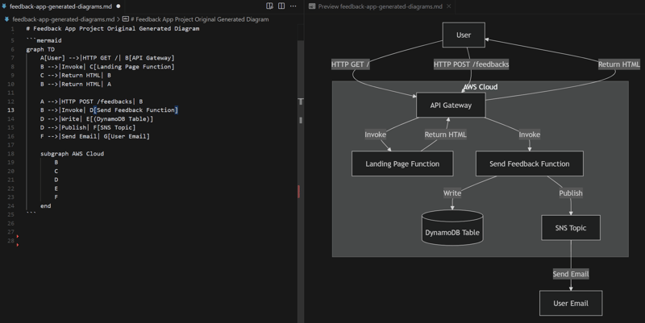
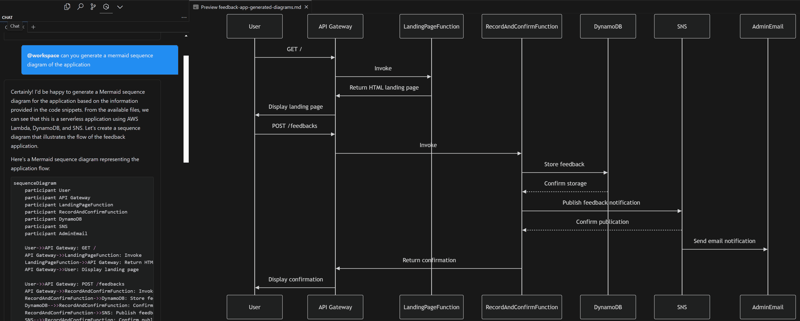
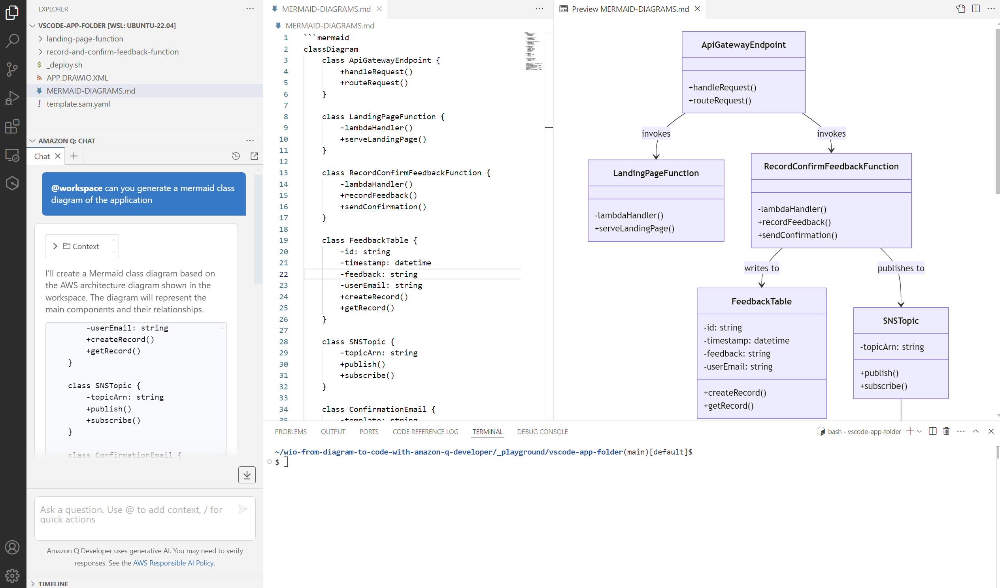
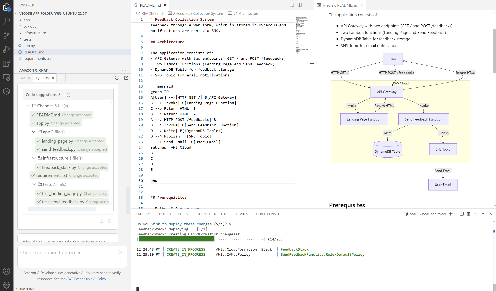

# 0 - Start tutorials playground ( i.e. new VS Code Window)

The command below will open a new VS Code window. 
That means you will have a blank playground where you will import a tutorial starting point.

```bash
# From wio-from-diagram-to-code-with-amazon-q-developer/
$> ./start-vscode-tutorial-window.sh
```

If something doesn't work in this tutorial, these commands can help:

Remove amazonq cache content  
 ```$> rm ~/.aws/amazonq/cache/cache/*```
 
 Reload VS Code window  
 ```Ctrl / Shift / P / Developer: Reload Window```

 OR
 
 ``` ../init-playground.sh --hard ```

which removes all files in the playground folder and amazonq cache content (that does not reload window)

# 1 - From Code to Diagram with Mermaid

### Initialize tutorial

```bash
# In VS Code tutorial window terminal:
$ ../init-playground.sh 

Available starting points:

0. Empty Folder (from Code to Diagram)
1. Feedback App Code (from Code to Diagram)
2. Feedback App Diagram (from Diagram to Code)
3. S3 notification (from Diagram to Code)
4. Data pipeline (from Diagram to Code)
5. Deployment pipeline (from Diagram to Code)

Where do you want to start from (0-5)?: 1
```

## 1.1 - Generate Application diagram

**N.B.: When using @workspace, 
you might need to type @workspace in Q manually and then copy/paste the rest of the prompt**

Q prompt:

| **@workspace can you generate a mermaid diagram of my application**

Result Example:



Open the MERMAID-DIAGRAMS.md file in the folder and add the generated response.

Save the file and click on Preview on the right hand corner.

Click on preview, to preview .md file

## 1.2 - Generate Sequence diagram

**N.B.: When using @workspace, 
you might need to type @workspace in Q manually and then copy/paste the rest of the prompt**

Q prompt:

| **@workspace can you generate a mermaid sequence diagram of the application**

Result Example:



Open the MERMAID-DIAGRAMS.md file in the folder and add the generated response.

Save the file and click on Preview on the right hand corner.

Click on preview, to preview .md file

## 1.3 - Generate Class diagram

**N.B.: When using @workspace, 
you might need to type @workspace in Q manually and then copy/paste the rest of the prompt**

Q prompt:

| **@workspace can you generate a mermaid class diagram of the application**

Result Example:



Open the MERMAID-DIAGRAMS.md file in the folder and add the generated response.

Save the file and click on Preview on the right hand corner.

Click on preview, to preview .md file

# 2 - From Diagram to Code with Mermaid

### Initialize tutorial

```bash
# In VS Code tutorial window terminal:
$ ../init-playground.sh 

Available starting points:

0. Empty Folder (from Code to Diagram)
1. Feedback App Code (from Code to Diagram)
2. Feedback App Diagram (from Diagram to Code)
3. S3 notification (from Diagram to Code)
4. Data pipeline (from Diagram to Code)
5. Deployment pipeline (from Diagram to Code)

Where do you want to start from (0-5)?: 0
```

Q Prompt:


| **/dev can you generate application files from this mermaid diagram (I want the code of the lambdas to be written in python and the infrastructure as code with the python cdk v2)
graph TD  
A[User] -->|HTTP GET /| B[API Gateway]  
B -->|Invoke| C[Landing Page Function]  
C -->|Return HTML| B  
B -->|Return HTML| A  
A -->|HTTP POST /feedbacks| B  
B -->|Invoke| D[Send Feedback Function]  
D -->|Write| E[(DynamoDB Table)]  
D -->|Publish| F[SNS Topic]  
F -->|Send Email| G[User Email]  
subgraph AWS Cloud  
B  
C  
D  
E  
F  
end**

Accept changes, and try to deploy the application with the CDK

Result Example:



#### CDK installation
```bash
$> curl -o- https://raw.githubusercontent.com/nvm-sh/nvm/master/install.sh | bash
$> . ~/.bashrc 
$> nvm install --lts
$> npm install -g aws-cdk
```

#### CDK packages installation
```bash
$> sudo apt install python3-pip # if pip not installed yet
$> pip install -r requirements.txt
```

#### Deploy the application (N.B. The AWS CLI must be configured with credentials)
```bash
cdk deploy --app "python3 app.py"
```

### Test & fix the generated result

# 3 - From Diagram to Code with Draw.io

### Initialize tutorial

```bash
# In VS Code tutorial window terminal:
$ ../init-playground.sh 

Available starting points:

0. Empty Folder (from Code to Diagram)
1. Feedback App Code (from Code to Diagram)
2. Feedback App Diagram (from Diagram to Code)
3. S3 notification (from Diagram to Code)
4. Data pipeline (from Diagram to Code)
5. Deployment pipeline (from Diagram to Code)

Where do you want to start from (0-5)?: 2
```

Drawio source diagram:


## 3.1 - From Diagram to Code with Draw.io (using Q Desktop)

Q Prompt:

| **/dev can you generate application from the drawio diagram (I want the code of the lambdas to be written in python and the infrastructure as code with the python cdk v2)**

Result Example:


#### Deploy the application (N.B. The AWS CLI must be configured with credentials)
```bash
cdk deploy --app "python3 app.py"
```

## 3.2 - From Diagram to Code with Draw.io (using Q CLI)


-> Open terminal and type:

```
$> q chat
```

then

|> **can you generate application from the drawio diagram (I want the code of the lambdas to be written in python and the infrastructure as code with the python cdk v2)**

-> Say yes (y) to all

|> **modify the drawio diagram to split the architecture diagram into well defined cdk construts (use colors and legend)**

-> Say yes (y) to all

Result example:


-> Deploy generated code in your folder with 'cdk deploy'


# 4 - From Code to Diagram with Draw.io

### Initialize tutorial

```bash
# In VS Code tutorial window terminal:
$ ../init-playground.sh 

Available starting points:

0. Empty Folder (from Code to Diagram)
1. Feedback App Code (from Code to Diagram)
2. Feedback App Diagram (from Diagram to Code)
3. S3 notification (from Diagram to Code)
4. Data pipeline (from Diagram to Code)
5. Deployment pipeline (from Diagram to Code)

Where do you want to start from (0-5)?: 2
```

**N.B.: When using @workspace, 
you might need to type @workspace in Q manually and then copy/paste the rest of the prompt**

Q Prompt:

| **@workspace generate a draw.io diagram in an xml format for this application (I want to use AWS 2024 Icons, lines should be orthogonal, dataflow from up to bottom)**

Result Example:


### Update app.drawio.xml file & display the content

Select 'app.drawio.xml' file, right click, choose 'Open with...' and select 'Text Editor'

Copy & Paste generated XML document

Save the file, and double click on it to open it with the Drawio Integration extension

### Fix / Troubleshoot

In case of an error when opening the diagram, add this to your prompt, that can solve the issue:

| **I got an error when I want to open the diagram**

---
[MORE TUTORIALS](README-More.md)