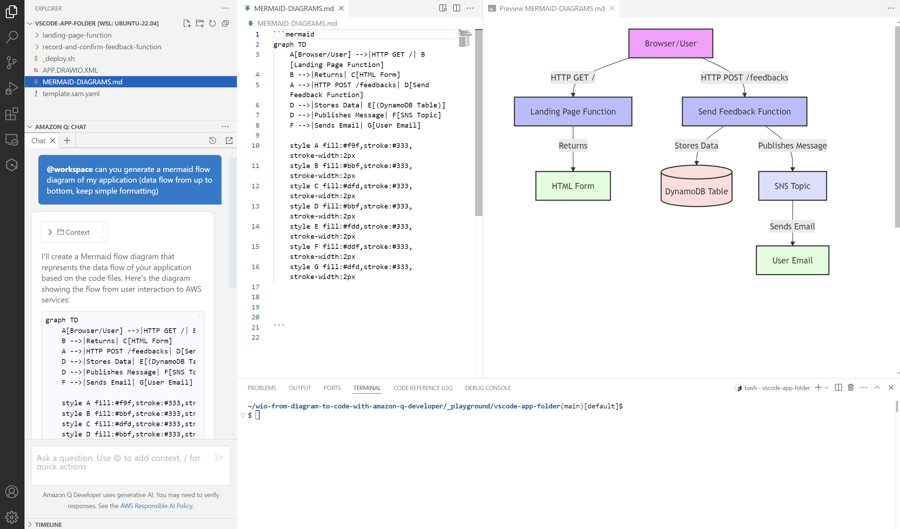
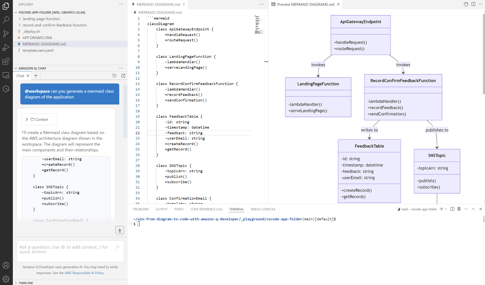
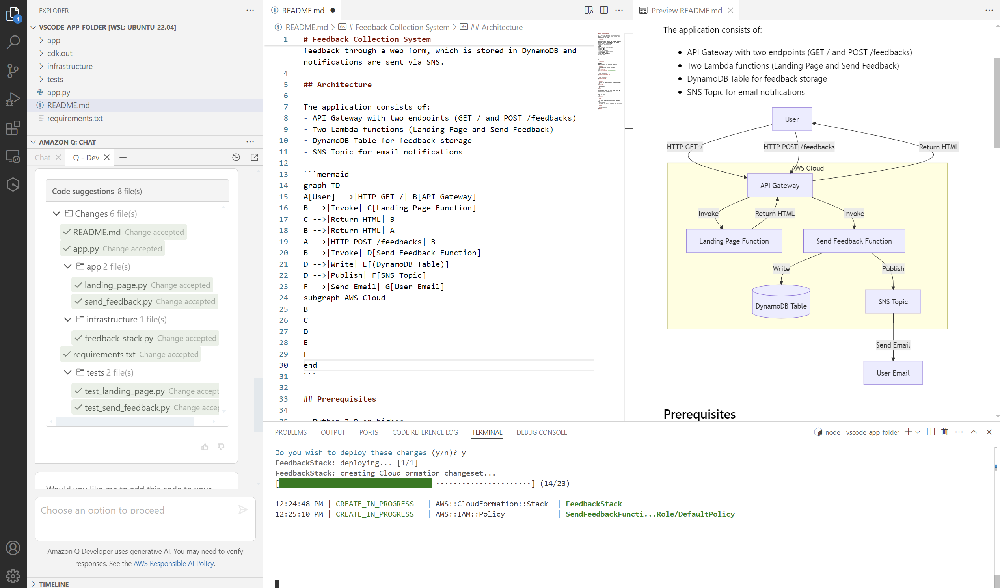
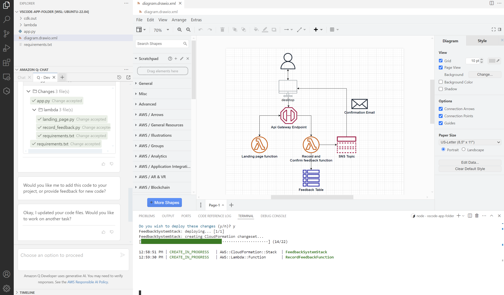
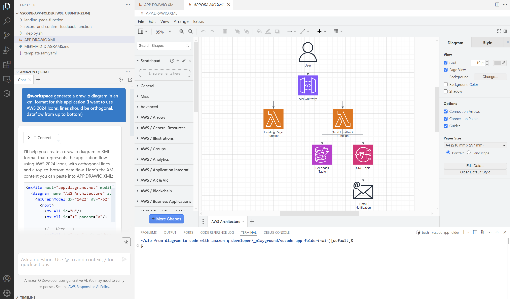
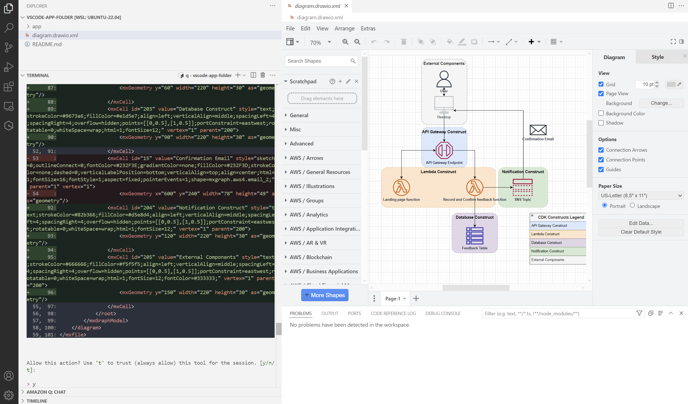
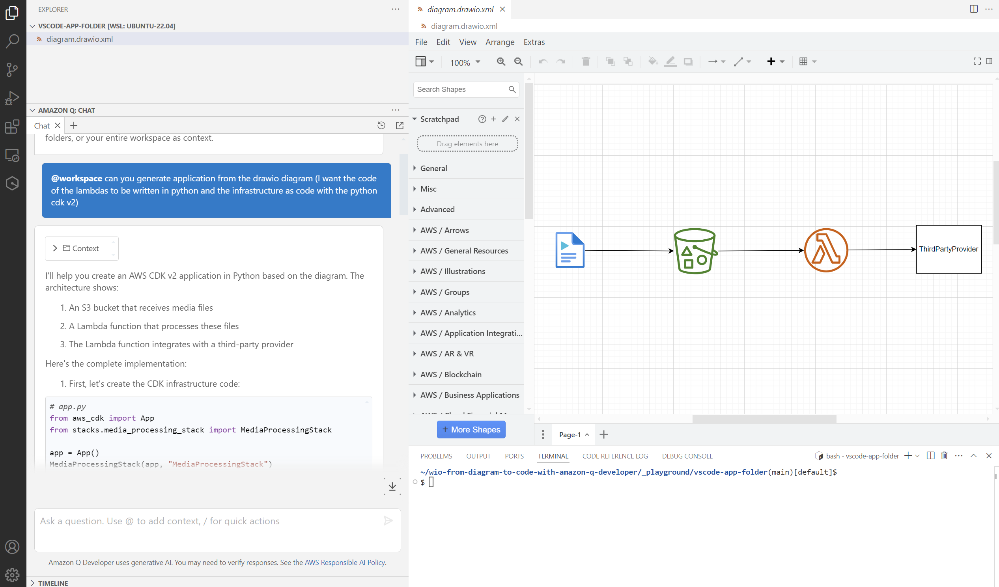
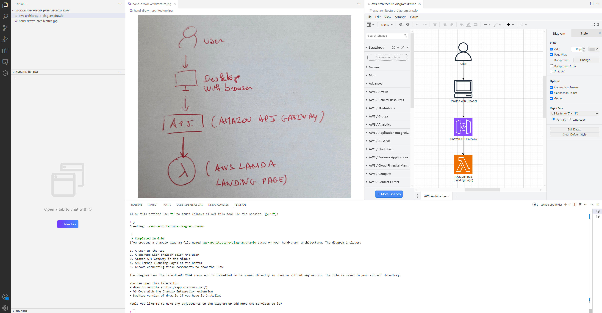

# Tutorial Index
1. [Generate Mermaid Architecture Diagram from Code](#1-generate-mermaid-architecture-diagram-from-code)
2. [Generate Mermaid Sequence Diagram from Code](#2-generate-mermaid-sequence-diagram-from-code)
3. [Generate Mermaid Class Diagram from Code](#3-generate-mermaid-class-diagram-from-code)
4. [Generate Code from Mermaid Diagram](#4-generate-code-from-mermaid-diagram)
5. [Generate Code from Drawio Diagram](#5-generate-code-from-drawio-diagram)
6. [Generate Drawio Flow Diagram from Code](#6-generate-drawio-flow-diagram-from-code)
7. [Split Drawio Diagram into CDK Constructs](#7-split-drawio-diagram-into-cdk-constructs)
8. [Generate Code from Drawio Diagram - S3 Notification](#8-generate-code-from-drawio-diagram---s3-notification)
9. [Generate Code from Drawio Diagram - Step Functions](#9-generate-code-from-drawio-diagram---step-functions)
10. [Generate Code from Drawio Diagram - Deployment Pipeline](#10-generate-code-from-drawio-diagram---deployment-pipeline)
11. [Generate Code from HandDrawn Diagram - Landing Page](#11-generate-code-from-handdrawn-diagram---landing-page)

## 1. Generate Mermaid Architecture Diagram from Code

### Script to execute In VS Code terminal (```~/wio-from-diagram-to-code-with-amazon-q-developer/_playground/vscode-app-folder$```)
```
../init-playground.sh --with-starting-point-folder=feedback-app-code
```

### Prompts to execute In Q Desktop, Q CLI, Kiro, ...
```
create a mermaid architecture diagram of my application (data flow from up to bottom, use colors, keep formatting simple)
```

### Result Example


## 2. Generate Mermaid Sequence Diagram from Code

### Script to execute In VS Code terminal (```~/wio-from-diagram-to-code-with-amazon-q-developer/_playground/vscode-app-folder$```)
```
../init-playground.sh --with-starting-point-folder=feedback-app-code
```

### Prompts to execute In Q Desktop, Q CLI, Kiro, ...
```
create a mermaid sequence diagram of the application
```

### Result Example


## 3. Generate Mermaid Class Diagram from Code

### Script to execute In VS Code terminal (```~/wio-from-diagram-to-code-with-amazon-q-developer/_playground/vscode-app-folder$```)
```
../init-playground.sh --with-starting-point-folder=feedback-app-code
```

### Prompts to execute In Q Desktop, Q CLI, Kiro, ...
```
create a mermaid class diagram of the application
```

### Result Example


## 4. Generate Code from Mermaid Diagram

### Script to execute In VS Code terminal (```~/wio-from-diagram-to-code-with-amazon-q-developer/_playground/vscode-app-folder$```)
```
../init-playground.sh --with-starting-point-folder=empty
```

### Prompts to execute In Q Desktop, Q CLI, Kiro, ...
```
can you generate application files from this mermaid diagram (I want the code of the lambdas to be written in python and the infrastructure as code with the python cdk v2)
graph TD  
A[User] -->|HTTP GET /| B[API Gateway]  
B -->|Invoke| C[Landing Page Function]  
C -->|Return HTML| B  
B -->|Return HTML| A  
A -->|HTTP POST /feedbacks| B  
B -->|Invoke| D[Send Feedback Function]  
D -->|Write| E[(DynamoDB Table)]  
D -->|Publish| F[SNS Topic]  
F -->|Send Email| G[User Email]  
subgraph AWS Cloud  
B  
C  
D  
E  
F  
end

```

### Result Example


## 5. Generate Code from Drawio Diagram

### Script to execute In VS Code terminal (```~/wio-from-diagram-to-code-with-amazon-q-developer/_playground/vscode-app-folder$```)
```
../init-playground.sh --with-starting-point-folder=feedback-app-diagram
```

### Prompts to execute In Q Desktop, Q CLI, Kiro, ...
```
generate application from the drawio diagram (I want the code of the lambdas to be written in python and the infrastructure as code with the python cdk v2)
```

### Result Example


## 6. Generate Drawio Flow Diagram from Code

### Script to execute In VS Code terminal (```~/wio-from-diagram-to-code-with-amazon-q-developer/_playground/vscode-app-folder$```)
```
../init-playground.sh --with-starting-point-folder=feedback-app-code
```

### Prompts to execute In Q Desktop, Q CLI, Kiro, ...
```
create a draw.io diagram in an xml format for this application (I want to use AWS 2024 Icons, lines should be orthogonal, dataflow from up to bottom)
```

### Result Example


## 7. Split Drawio Diagram into CDK Constructs

### Script to execute In VS Code terminal (```~/wio-from-diagram-to-code-with-amazon-q-developer/_playground/vscode-app-folder$```)
```
../init-playground.sh --with-starting-point-folder=feedback-app-diagram
```

### Prompts to execute In Q Desktop, Q CLI, Kiro, ...
```
modify the drawio diagram to split the architecture diagram into well defined cdk construts (use colors and legend)
```

### Result Example


## 8. Generate Code from Drawio Diagram - S3 Notification

### Script to execute In VS Code terminal (```~/wio-from-diagram-to-code-with-amazon-q-developer/_playground/vscode-app-folder$```)
```
../init-playground.sh --with-starting-point-folder=s3-notification-diagram
```

### Prompts to execute In Q Desktop, Q CLI, Kiro, ...
```
generate lambda function code in python from diagram
```
### Prompts to execute In Q Desktop, Q CLI, Kiro, ...
```
generate python cdk V2 template from diagram
```

### Result Example


## 9. Generate Code from Drawio Diagram - Step Functions

### Script to execute In VS Code terminal (```~/wio-from-diagram-to-code-with-amazon-q-developer/_playground/vscode-app-folder$```)
```
../init-playground.sh --with-starting-point-folder=data-pipeline-diagram
```

### Prompts to execute In Q Desktop, Q CLI, Kiro, ...
```
generate lambda code in the drawio diagram (take notes into account)
```
### Prompts to execute In Q Desktop, Q CLI, Kiro, ...
```
generate infrastructure with CDK V2 (be aware that you have a step functions workflow with lambda orchestration in the diagram)
```

### Result Example


## 10. Generate Code from Drawio Diagram - Deployment Pipeline

### Script to execute In VS Code terminal (```~/wio-from-diagram-to-code-with-amazon-q-developer/_playground/vscode-app-folder$```)
```
../init-playground.sh --with-starting-point-folder=deployment-pipeline
```

### Prompts to execute In Q Desktop, Q CLI, Kiro, ...
```
can you generate the deployment pipeline with python cdk v2 from my diagram
```

### Result Example


## 11. Generate Code from HandDrawn Diagram - Landing Page

### Script to execute In VS Code terminal (```~/wio-from-diagram-to-code-with-amazon-q-developer/_playground/vscode-app-folder$```)
```
../init-playground.sh --with-starting-point-folder=lambda-app-hand-drawn-diagram
```

### Prompts to execute In Q Desktop, Q CLI, Kiro, ...
```
create a mermaid diagram from the hand-drawn-architecture.jpg file in this folder
```
### Prompts to execute In Q Desktop, Q CLI, Kiro, ...
```
create a draw.io diagram from the hand-drawn-architecture.jpg (I want to use AWS 2024 Icons)
```
### Prompts to execute In Q Desktop, Q CLI, Kiro, ...
```
can you generate application from the hand-drawn-architecture file (I want the code of the lambdas to be written in python and the infrastructure as code with the python cdk v2)
```

### Result Example


