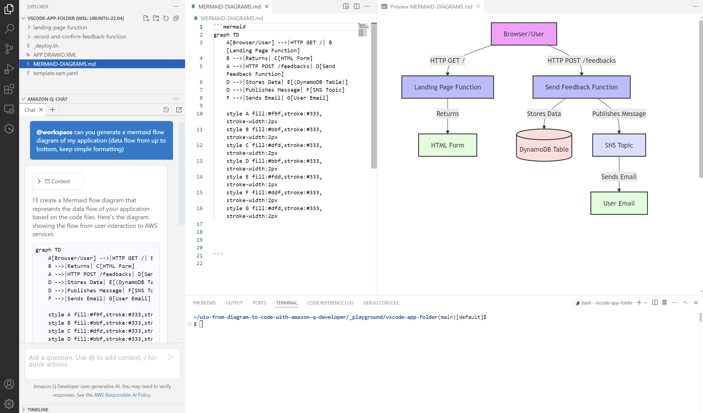
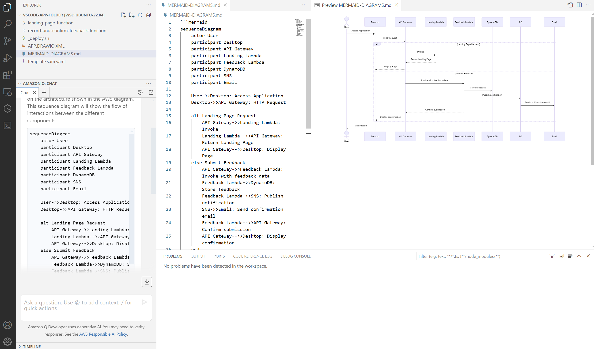
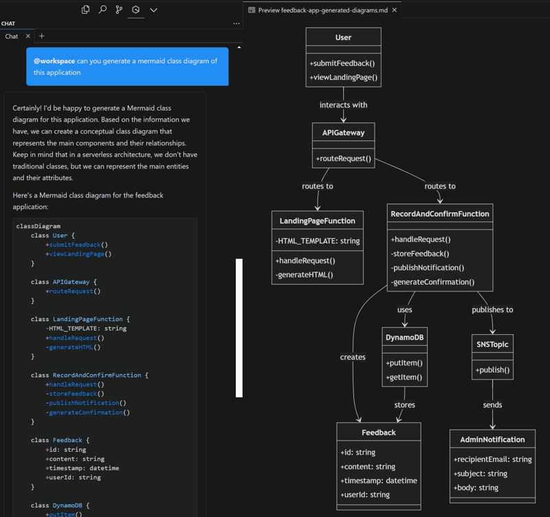

# Tutorial Index
1. [Generate Flow Diagram](#1-generate-flow-diagram)
2. [Generate Sequence Diagram](#2-generate-sequence-diagram)
3. [Generate Class Diagram](#3-generate-class-diagram)

## 1. Generate Flow Diagram

### Initialize Tutorial (In VS Code tutorial window terminal)
```
../init-playground.sh --with-starting-point-folder=feedback-app-code
```

### Write Prompt (In Q Desktop, Q CLI, Kiro, ...)
```
generate a mermaid flow diagram of my application (data flow from up to bottom, use colors, keep formatting simple)
```

### Result Example


## 2. Generate Sequence Diagram

### Initialize Tutorial (In VS Code tutorial window terminal)
```
../init-playground.sh --with-starting-point-folder=feedback-app-code
```

### Write Prompt (In Q Desktop, Q CLI, Kiro, ...)
```
generate a mermaid sequence diagram of the application
```

### Result Example


## 3. Generate Class Diagram

### Initialize Tutorial (In VS Code tutorial window terminal)
```
../init-playground.sh --with-starting-point-folder=feedback-app-code
```

### Write Prompt (In Q Desktop, Q CLI, Kiro, ...)
```
generate a mermaid sequence diagram of the application
```

### Result Example


