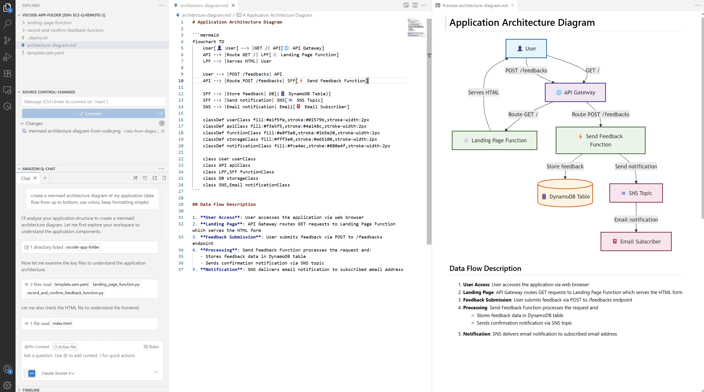
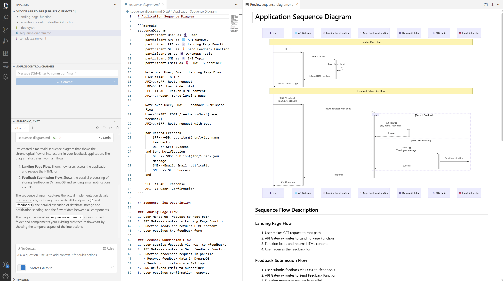
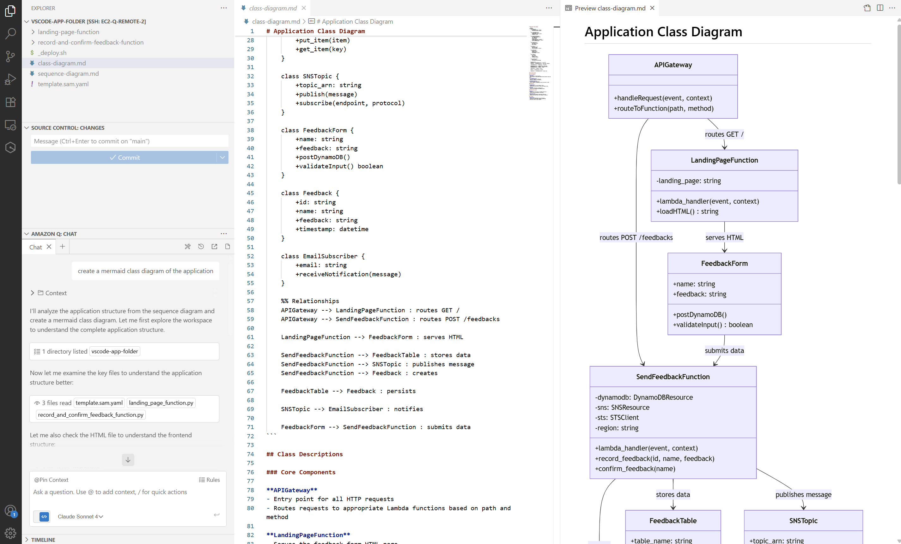
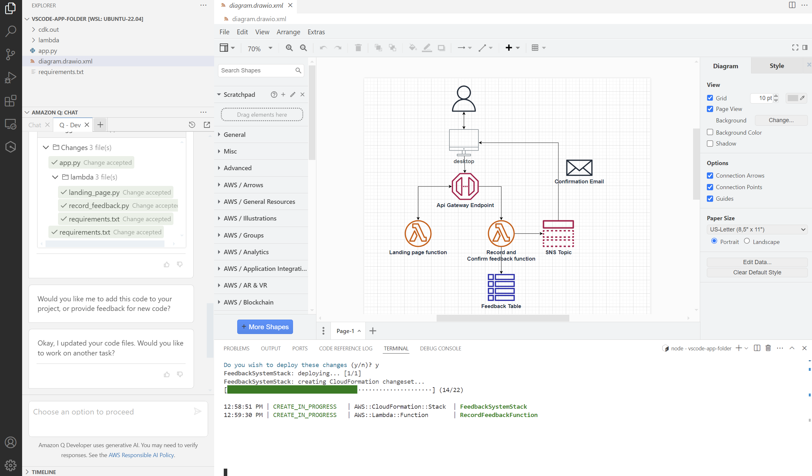
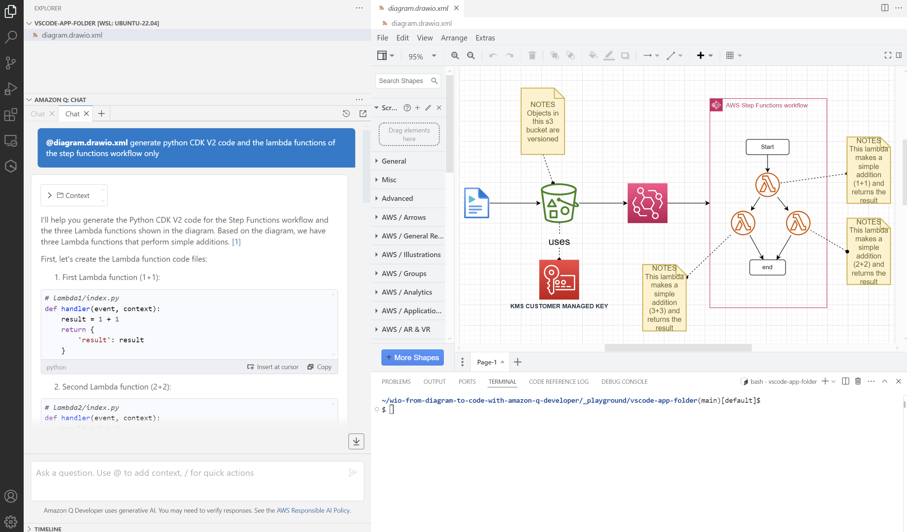
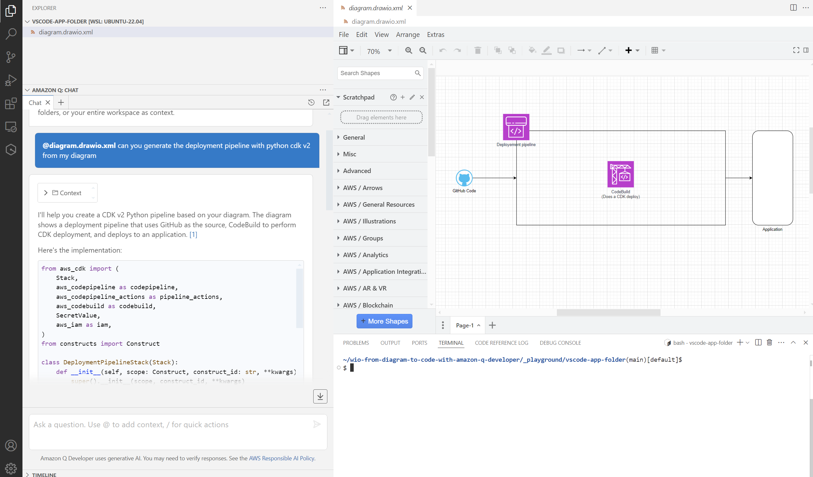
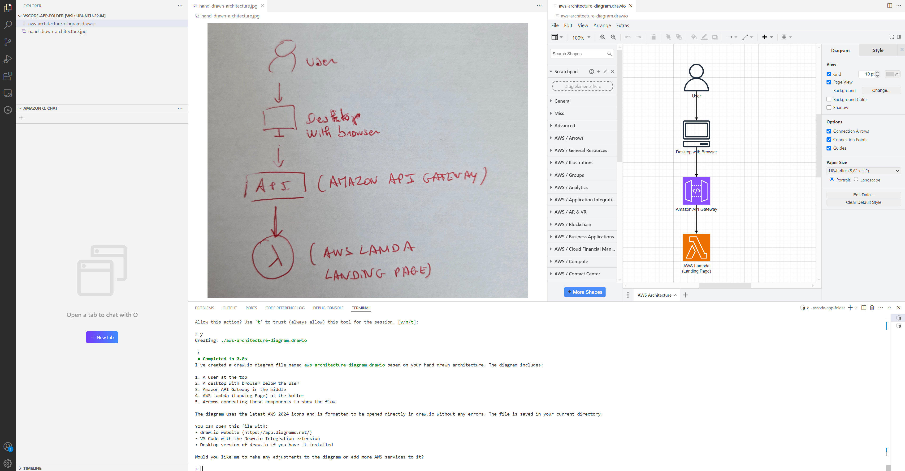
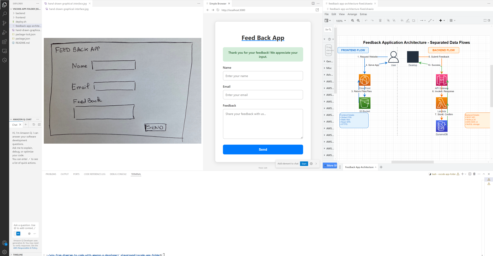
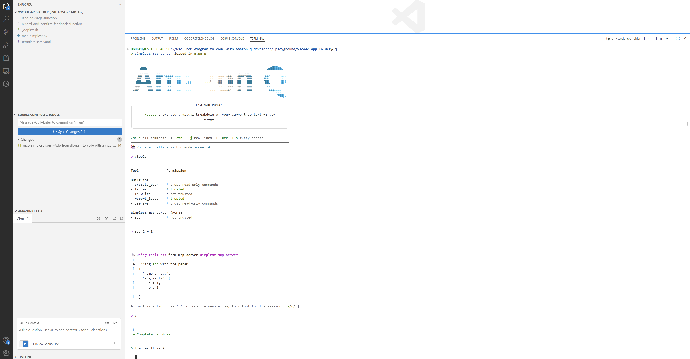
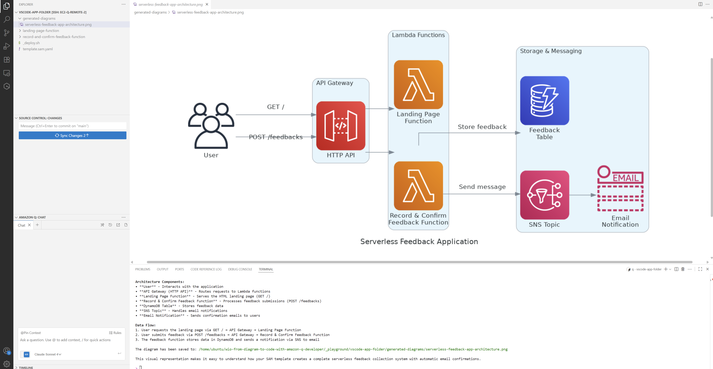

# Tutorial Index

1. [Generate Mermaid Diagram from Code](_playground/TUTORIALS#1-generate-mermaid-diagram-from-code)

    - 1.1 [Generate Mermaid - Architecture Diagram - from Code - Feedback App](_playground/TUTORIALS#11-generate-mermaid---architecture-diagram---from-code---feedback-app)
    - 1.2 [Generate Mermaid - Sequence Diagram - from Code - Feedback App](_playground/TUTORIALS#12-generate-mermaid---sequence-diagram---from-code---feedback-app)
    - 1.3 [Generate Mermaid - Class Diagram - from Code - Feedback App](_playground/TUTORIALS#13-generate-mermaid---class-diagram---from-code---feedback-app)

2. [Generate Drawio Diagram from Code](_playground/TUTORIALS#2-generate-drawio-diagram-from-code)

    - 2.1 [Generate Drawio - Architecture Diagram - from Code - Feedback App](_playground/TUTORIALS#21-generate-drawio---architecture-diagram---from-code---feedback-app)

3. [Generate Code from Mermaid Diagram](_playground/TUTORIALS#3-generate-code-from-mermaid-diagram)

    - 3.1 [Generate Code from Mermaid Diagram - Feedback App](_playground/TUTORIALS#31-generate-code-from-mermaid-diagram---feedback-app)

4. [Generate Code from Drawio Diagram](_playground/TUTORIALS#4-generate-code-from-drawio-diagram)

    - 4.1 [Generate Code from Drawio Diagram - Feedback App](_playground/TUTORIALS#41-generate-code-from-drawio-diagram---feedback-app)
    - 4.2 [Generate Code from Drawio Diagram - S3 Notification](_playground/TUTORIALS#42-generate-code-from-drawio-diagram---s3-notification)
    - 4.3 [Generate Code from Drawio Diagram - Step Functions](_playground/TUTORIALS#43-generate-code-from-drawio-diagram---step-functions)
    - 4.4 [Generate Code from Drawio Diagram - Deployment Pipeline](_playground/TUTORIALS#44-generate-code-from-drawio-diagram---deployment-pipeline)
    - 4.5 [Generate Code from Drawio Diagram - API Gateway](_playground/TUTORIALS#45-generate-code-from-drawio-diagram---api-gateway)

5. [Generate Code from Hand-Drawn Diagram](_playground/TUTORIALS#5-generate-code-from-hand-drawn-diagram)

    - 5.1 [Generate Code from HandDrawn Diagram - Lambda App](_playground/TUTORIALS#51-generate-code-from-handdrawn-diagram---lambda-app)
    - 5.2 [Generate Code from HandDrawn Diagram - ECS App](_playground/TUTORIALS#52-generate-code-from-handdrawn-diagram---ecs-app)
    - 5.3 [Generate Code from HandDrawn Diagram - GUI](_playground/TUTORIALS#53-generate-code-from-handdrawn-diagram---gui)

6. [Transform Drawio Diagram](_playground/TUTORIALS#6-transform-drawio-diagram)

    - 6.1 [Split Drawio Diagram into CDK Constructs](_playground/TUTORIALS#61-split-drawio-diagram-into-cdk-constructs)

7. [Understand MCP with Pyhon Diagrams](_playground/TUTORIALS#7-understand-mcp-with-pyhon-diagrams)

    - 7.1 [Create Simplest MCP](_playground/TUTORIALS#71-create-simplest-mcp)
    - 7.2 [Generate Python Diagrams - Arhitecture Diagram - from Code - Feedback App](_playground/TUTORIALS#72-generate-python-diagrams---arhitecture-diagram---from-code---feedback-app)

# 1. Generate Mermaid Diagram from Code

## 1.1. Generate Mermaid - Architecture Diagram - from Code - Feedback App

### [=> PREREQUISITES](../README.md#prerequisites)

### Script to execute In VS Code terminal ('_playground/vscode-app-folder/')
```
../init-playground.sh --with-starting-point-folder=feedback-app-code
```

### Prompts to execute In Q Desktop, Q CLI, Kiro, ...
```
create a mermaid architecture diagram of my application (data flow from up to bottom, use colors, keep formatting simple)
```

### Result Example



## 1.2. Generate Mermaid - Sequence Diagram - from Code - Feedback App

### [=> PREREQUISITES](../README.md#prerequisites)

### Script to execute In VS Code terminal ('_playground/vscode-app-folder/')
```
../init-playground.sh --with-starting-point-folder=feedback-app-code
```

### Prompts to execute In Q Desktop, Q CLI, Kiro, ...
```
create a mermaid sequence diagram of the application
```

### Result Example



## 1.3. Generate Mermaid - Class Diagram - from Code - Feedback App

### [=> PREREQUISITES](../README.md#prerequisites)

### Script to execute In VS Code terminal ('_playground/vscode-app-folder/')
```
../init-playground.sh --with-starting-point-folder=feedback-app-code
```

### Prompts to execute In Q Desktop, Q CLI, Kiro, ...
```
create a mermaid class diagram of the application
```

### Result Example



# 2. Generate Drawio Diagram from Code

## 2.1. Generate Drawio - Architecture Diagram - from Code - Feedback App

### [=> PREREQUISITES](../README.md#prerequisites)

### Script to execute In VS Code terminal ('_playground/vscode-app-folder/')
```
../init-playground.sh --with-starting-point-folder=feedback-app-code
```

### Prompts to execute In Q Desktop, Q CLI, Kiro, ...
```
create a draw.io diagram in an xml format for this application (I want to use AWS 2024 Icons, lines should be orthogonal, dataflow from up to bottom)
```

### Result Example


# 3. Generate Code from Mermaid Diagram

## 3.1. Generate Code from Mermaid Diagram - Feedback App

### [=> PREREQUISITES](../README.md#prerequisites)

### Script to execute In VS Code terminal ('_playground/vscode-app-folder/')
```
../init-playground.sh --with-starting-point-folder=empty
```

### Prompts to execute In Q Desktop, Q CLI, Kiro, ...
```
can you generate application files from this mermaid diagram (I want the code of the lambdas to be written in python and the infrastructure as code with the python cdk v2)
graph TD  
A[User] -->|HTTP GET /| B[API Gateway]  
B -->|Invoke| C[Landing Page Function]  
C -->|Return HTML| B  
B -->|Return HTML| A  
A -->|HTTP POST /feedbacks| B  
B -->|Invoke| D[Send Feedback Function]  
D -->|Write| E[(DynamoDB Table)]  
D -->|Publish| F[SNS Topic]  
F -->|Send Email| G[User Email]  
subgraph AWS Cloud  
B  
C  
D  
E  
F  
end

```

### Result Example


# 4. Generate Code from Drawio Diagram

## 4.1. Generate Code from Drawio Diagram - Feedback App

### [=> PREREQUISITES](../README.md#prerequisites)

### Script to execute In VS Code terminal ('_playground/vscode-app-folder/')
```
../init-playground.sh --with-starting-point-folder=feedback-app-diagram
```

### Prompts to execute In Q Desktop, Q CLI, Kiro, ...
```
generate application from the drawio diagram (I want the code of the lambdas to be written in python and the infrastructure as code with the python cdk v2)
```

### Result Example



## 4.2. Generate Code from Drawio Diagram - S3 Notification

### [=> PREREQUISITES](../README.md#prerequisites)

### Script to execute In VS Code terminal ('_playground/vscode-app-folder/')
```
../init-playground.sh --with-starting-point-folder=s3-notification-diagram
```

### Prompts to execute In Q Desktop, Q CLI, Kiro, ...
```
generate lambda function code in python from diagram
```
```
generate python cdk V2 template from diagram
```

### Result Example


## 4.3. Generate Code from Drawio Diagram - Step Functions

### [=> PREREQUISITES](../README.md#prerequisites)

### Script to execute In VS Code terminal ('_playground/vscode-app-folder/')
```
../init-playground.sh --with-starting-point-folder=data-pipeline-diagram
```

### Prompts to execute In Q Desktop, Q CLI, Kiro, ...
```
generate lambda code in the drawio diagram (take notes into account)
```
```
generate infrastructure with CDK V2 (be aware that you have a step functions workflow with lambda orchestration in the diagram)
```

### Result Example



## 4.4. Generate Code from Drawio Diagram - Deployment Pipeline

### [=> PREREQUISITES](../README.md#prerequisites)

### Script to execute In VS Code terminal ('_playground/vscode-app-folder/')
```
../init-playground.sh --with-starting-point-folder=deployment-pipeline
```

### Prompts to execute In Q Desktop, Q CLI, Kiro, ...
```
can you generate the deployment pipeline with python cdk v2 from my diagram
```

### Result Example



## 4.5. Generate Code from Drawio Diagram - API Gateway

### [=> PREREQUISITES](../README.md#prerequisites)

### Script to execute In VS Code terminal ('_playground/vscode-app-folder/')
```
../init-playground.sh --with-starting-point-folder=api-gateway-diagram --with-q-rules
```

### Prompts to execute In Q Desktop, Q CLI, Kiro, ...
```
generate application
```

### Result Example


# 5. Generate Code from Hand-Drawn Diagram

## 5.1. Generate Code from HandDrawn Diagram - Lambda App

### [=> PREREQUISITES](../README.md#prerequisites)

### Script to execute In VS Code terminal ('_playground/vscode-app-folder/')
```
../init-playground.sh --with-starting-point-folder=lambda-app-hand-drawn-diagram
```

### Prompts to execute In Q Desktop, Q CLI, Kiro, ...
```
create a mermaid diagram from the hand-drawn-architecture.jpg file in this folder
```
```
create a draw.io diagram from the hand-drawn-architecture.jpg (I want to use AWS 2024 Icons)
```
```
can you generate application from the hand-drawn-architecture file (I want the code of the lambdas to be written in python and the infrastructure as code with the python cdk v2)
```

### Result Example



## 5.2. Generate Code from HandDrawn Diagram - ECS App

### [=> PREREQUISITES](../README.md#prerequisites)

### Script to execute In VS Code terminal ('_playground/vscode-app-folder/')
```
../init-playground.sh --with-starting-point-folder=ecs-app-hand-drawn-diagram
```

### Prompts to execute In Q Desktop, Q CLI, Kiro, ...
```
create a mermaid diagram from the hand-drawn-architecture.jpg file in this folder. Keep all components at the original position. Note that ECR is outside the VPC.
```
```
create a drawio diagram from the hand-drawn-architecture.jpg file in this folder. Keep all components at the original position.
```
```
can you generate application from the hand-drawn-architecture.jpg file (I want the code of the lambdas to be written in python and the infrastructure as code with the python cdk v2).
```
```
can you generate application from the hand-drawn-architecture.jpg file (I want the code of the lambdas to be written in python and the infrastructure as code with the python cdk v2). Keep it simple, don't add more than necessary, stick to the diagram intent.
```

### Result Example


## 5.3. Generate Code from HandDrawn Diagram - GUI

### [=> PREREQUISITES](../README.md#prerequisites)

### Script to execute In VS Code terminal ('_playground/vscode-app-folder/')
```
../init-playground.sh --with-starting-point-folder=feedback-app-hand-drawn-diagram
```

### Prompts to execute In Q Desktop, Q CLI, Kiro, ...
```
Create an application from the hand-drawn-graphical-interface.jpg file. I want a CDK serverless backend.
```
```
create a drawio diagram of this application using AWS icons 2024 (dataflow from up to bottom)
```
```
in the drawio diagram add a user desktop and separate cloufront/s3 data flow from api/lambda/dynamo data flow
```

### Result Example



# 6. Transform Drawio Diagram

## 6.1. Split Drawio Diagram into CDK Constructs

### [=> PREREQUISITES](../README.md#prerequisites)

### Script to execute In VS Code terminal ('_playground/vscode-app-folder/')
```
../init-playground.sh --with-starting-point-folder=feedback-app-diagram
```

### Prompts to execute In Q Desktop, Q CLI, Kiro, ...
```
modify the drawio diagram to split the architecture diagram into well defined cdk construts (use colors and legend)
```

### Result Example


# 7. Understand MCP with Pyhon Diagrams

## 7.1. Create Simplest MCP

### [=> PREREQUISITES](../README.md#prerequisites)

### Script to execute In VS Code terminal ('_playground/vscode-app-folder/')
```
../init-playground.sh --with-starting-point-folder=empty --with-mcp-server=mcp-simplest.json
```

### Prompts to execute In Q Desktop, Q CLI, Kiro, ...
```
add 1 + 1
```

### Result Example



## 7.2. Generate Python Diagrams - Arhitecture Diagram - from Code - Feedback App

### [=> PREREQUISITES](../README.md#prerequisites)

### Script to execute In VS Code terminal ('_playground/vscode-app-folder/')
```
../init-playground.sh --with-starting-point-folder=feedback-app-code --with-mcp-server=mcp-python-diagrams.json
```

### Prompts to execute In Q Desktop, Q CLI, Kiro, ...
```
create a diagram from the code in this folder
```

### Result Example


