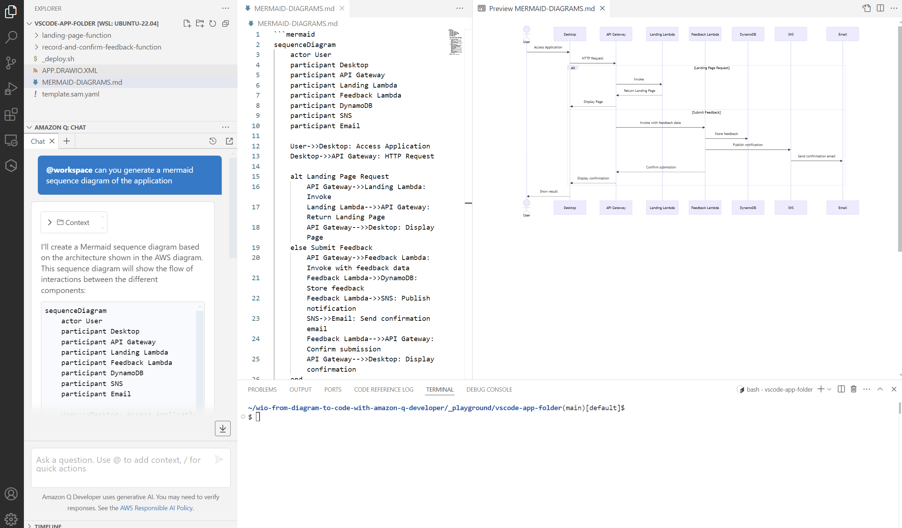

# Tutorial Index
1. [Generate Flow Diagram from Code](#1-generate-flow-diagram-from-code)
2. [Generate Sequence Diagram from Code](#2-generate-sequence-diagram-from-code)
3. [Generate Class Diagram from Code](#3-generate-class-diagram-from-code)
4. [Generate Code from Mermaid Diagram](#4-generate-code-from-mermaid-diagram)
5. [Generate Code from Drawio Diagram](#5-generate-code-from-drawio-diagram)
6. [Split Drawio Diagram into CDK Constructs](#6-split-drawio-diagram-into-cdk-constructs)

## 1. Generate Flow Diagram from Code

### Initialize Tutorial (In VS Code tutorial window terminal)
```
../init-playground.sh --with-starting-point-folder=feedback-app-code
```

### Write Prompt (In Q Desktop, Q CLI, Kiro, ...)
```
create a mermaid flow diagram of my application (data flow from up to bottom, use colors, keep formatting simple)
```

### Result Example


## 2. Generate Sequence Diagram from Code

### Initialize Tutorial (In VS Code tutorial window terminal)
```
../init-playground.sh --with-starting-point-folder=feedback-app-code
```

### Write Prompt (In Q Desktop, Q CLI, Kiro, ...)
```
create a mermaid sequence diagram of the application
```

### Result Example


## 3. Generate Class Diagram from Code

### Initialize Tutorial (In VS Code tutorial window terminal)
```
../init-playground.sh --with-starting-point-folder=feedback-app-code
```

### Write Prompt (In Q Desktop, Q CLI, Kiro, ...)
```
create a mermaid class diagram of the application
```

### Result Example


## 4. Generate Code from Mermaid Diagram

### Initialize Tutorial (In VS Code tutorial window terminal)
```
../init-playground.sh --with-starting-point-folder=empty
```

### Write Prompt (In Q Desktop, Q CLI, Kiro, ...)
```
can you generate application files from this mermaid diagram (I want the code of the lambdas to be written in python and the infrastructure as code with the python cdk v2)
graph TD  
A[User] -->|HTTP GET /| B[API Gateway]  
B -->|Invoke| C[Landing Page Function]  
C -->|Return HTML| B  
B -->|Return HTML| A  
A -->|HTTP POST /feedbacks| B  
B -->|Invoke| D[Send Feedback Function]  
D -->|Write| E[(DynamoDB Table)]  
D -->|Publish| F[SNS Topic]  
F -->|Send Email| G[User Email]  
subgraph AWS Cloud  
B  
C  
D  
E  
F  
end

```

### Result Example


## 5. Generate Code from Drawio Diagram

### Initialize Tutorial (In VS Code tutorial window terminal)
```
../init-playground.sh --with-starting-point-folder=feedback-app-diagram
```

### Write Prompt (In Q Desktop, Q CLI, Kiro, ...)
```
can you generate application from the drawio diagram (I want the code of the lambdas to be written in python and the infrastructure as code with the python cdk v2)
```

### Result Example


## 6. Split Drawio Diagram into CDK Constructs

### Initialize Tutorial (In VS Code tutorial window terminal)
```
../init-playground.sh --with-starting-point-folder=feedback-app-diagram
```

### Write Prompt (In Q Desktop, Q CLI, Kiro, ...)
```
modify the drawio diagram to split the architecture diagram into well defined cdk construts (use colors and legend)
```

### Result Example


