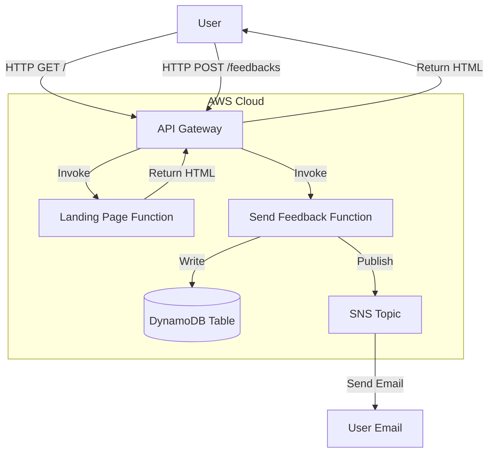
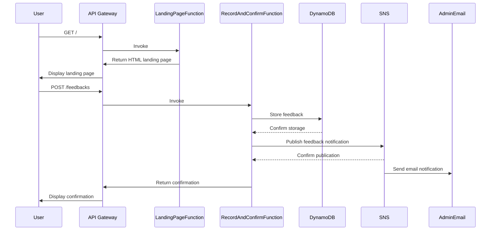
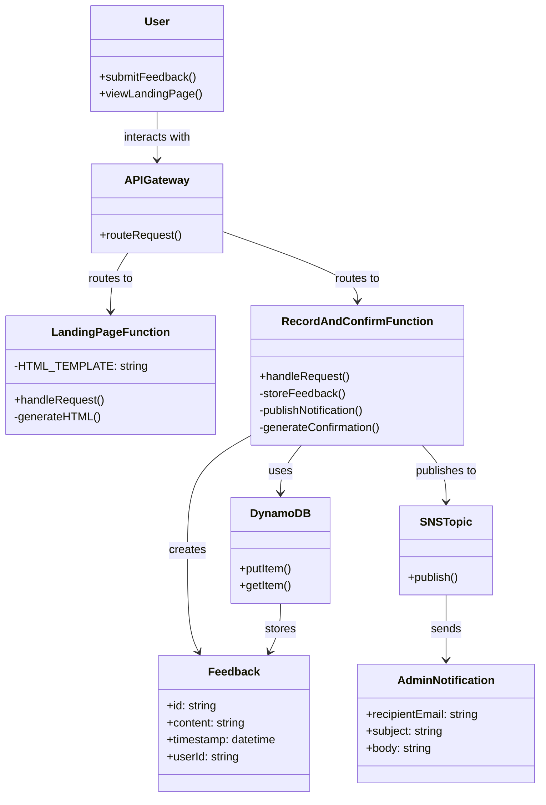

# Feedback App Project Original Generated Diagram

prompt: @workspace can you generate a mermaid diagram of my application

## Sequence Diagram

prompt:@workspace can you generate a mermaid sequence diagram of the application

## Class Diagram

@workspace can you generate a mermaid class diagram of the application

