# Architecture Diagram

```mermaid
graph TD
    A[👤 User] --> B[💻 Desktop with Browser]
    B --> C[🔗 API<br/>Amazon API Gateway]
    C --> D[⚡ AWS Lambda<br/>Landing Page]
    
    style A fill:#ffebee
    style B fill:#e3f2fd
    style C fill:#fff3e0
    style D fill:#e8f5e8
```

## Architecture Components

1. **User** - End user accessing the application
2. **Desktop with Browser** - Client-side interface for user interaction
3. **API (Amazon API Gateway)** - AWS service that handles API requests and routing
4. **AWS Lambda (Landing Page)** - Serverless function that serves the landing page content

## Flow Description

The architecture shows a simple serverless web application where:
- Users access the application through their browser
- Requests are routed through Amazon API Gateway
- AWS Lambda functions handle the backend logic and serve the landing page
