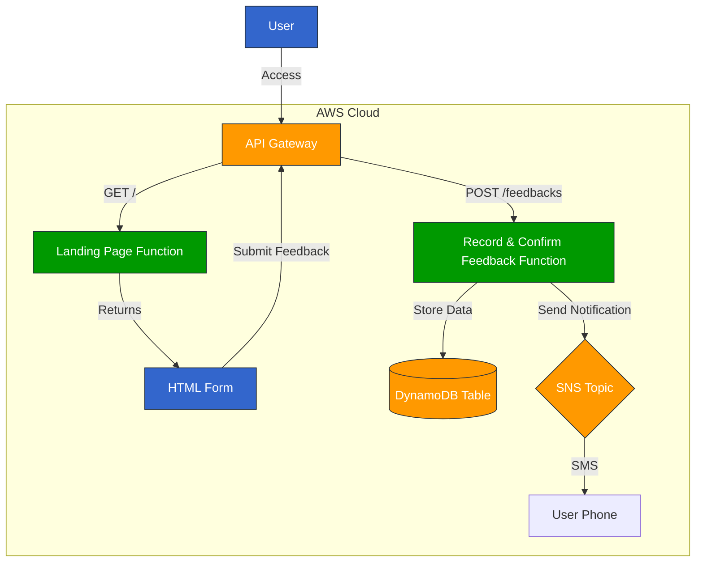

# Feedback Application Architecture

## Application Flow

1. User accesses the application through API Gateway
2. Landing Page Function serves the HTML form
3. User submits feedback via the form
4. API Gateway routes the POST request to the Record & Confirm Feedback Function
5. The function stores the feedback in DynamoDB
6. The function sends a confirmation notification via SNS
7. User receives a confirmation email

## Components

- **API Gateway**: Handles HTTP requests
- **Landing Page Function**: Lambda function that serves the HTML form
- **Record & Confirm Feedback Function**: Lambda function that processes feedback submissions
- **DynamoDB Table**: Stores feedback data
- **SNS Topic**: Sends email notifications