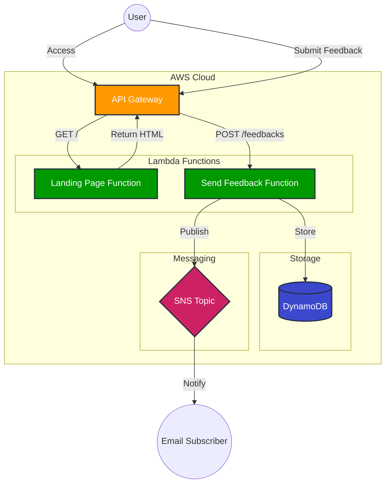

```mermaid
graph TD
    User((User))
    subgraph AWS Cloud
        APIG[API Gateway]
        
        subgraph Lambda Functions
            LPF[Landing Page Function]
            SFF[Send Feedback Function]
        end
        
        subgraph Storage
            DB[(DynamoDB)]
        end
        
        subgraph Messaging
            SNS{SNS Topic}
        end
    end
    Email((Email Subscriber))

    User -->|Access| APIG
    APIG -->|GET /| LPF
    LPF -->|Return HTML| APIG
    
    User -->|Submit Feedback| APIG
    APIG -->|POST /feedbacks| SFF
    SFF -->|Store| DB
    SFF -->|Publish| SNS
    SNS -->|Notify| Email

    classDef aws fill:#FF9900,stroke:#232F3E,stroke-width:2px,color:white
    classDef lambda fill:#009900,stroke:#232F3E,stroke-width:2px,color:white
    classDef storage fill:#3B48CC,stroke:#232F3E,stroke-width:2px,color:white
    classDef messaging fill:#CC2264,stroke:#232F3E,stroke-width:2px,color:white
    
    class APIG aws
    class LPF,SFF lambda
    class DB storage
    class SNS messaging


```
